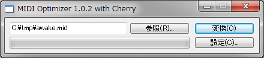

midioptc
========

標準 MIDI ファイルから不必要なイベントを削除する小さなツールです。

使用方法
------------------------

1. midioptc.exe を起動します。
2. 「**参照**」ボタンで、変換対象ファイルを選択します。
    - 入力ボックスにファイルパスを直接入力することもできます。
    - ウィンドウに対象ファイルをドロップすることもできます。
    - ワイルドカード（例：*.mid）を指定することで、複数のファイルを一括処理できます。
3. 「**設定**」ボタンを押すと、設定ダイアログが表示され、変換処理の詳細を設定することができます（後述）。
4. 「**変換**」ボタンを押すと、指定したファイルの変換処理が開始されます。

### 変換設定

以下の項目を設定ダイアログで設定できます。

変換終了時にダイアログを表示
  : すべての変換が終了した際に、変換終了を示すダイアログを表示します。チェックがない場合は、代わりにビープ音を再生します。

変換時にバックアップ(*.bak)を作成する
  : 変換前にバックアップファイルを作成します。

マーカーのメタイベントを削除する
  : マーカーのメタイベントを削除します。

調号のメタイベントを削除する
  : 調号のメタイベントを削除します。

テキストと歌詞のメタイベントを削除
  : テキストと歌詞のイベントをすべて削除します。

曲名とトラック名と著作権のテキストを削除
  : 曲名、トラック名、および著作権のメタイベントをすべて削除します。

トラック名のテキストを削除
  : トラック名のメタイベントを削除します。シーケンス名は削除されません。

フォーマット 1 のデータをフォーマット 0 に変換する（未実装）
  : 未実装機能です。[FC10](http://smaf-yamaha.com/jp/tools/downloads.html) などのツールで代替できます。

付記
------------------------

midioptc は [Cherry](http://www.vector.co.jp/soft/win95/art/se071842.html) の出力を簡素化するために、軽い気持ちで作成したツールです。

midioptc は 2003 年に [HSP](http://hsp.tv/) で作成されて以来、10年間眠り続けた骨董品です。今後わたしが本ツールを更新することはおそらくありません。
